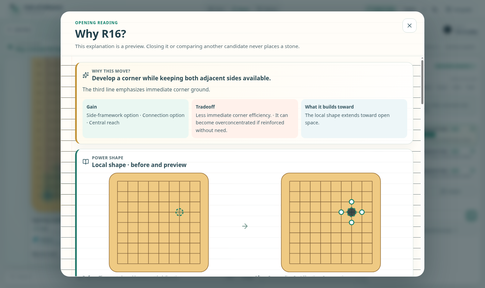

[English](../README.md) · [العربية](README.ar.md) · [Español](README.es.md) · [Français](README.fr.md) · [日本語](README.ja.md) · [한국어](README.ko.md) · [Tiếng Việt](README.vi.md) · [中文 (简体)](README.zh-Hans.md) · [中文（繁體）](README.zh-Hant.md) · [Deutsch](README.de.md) · [Русский](README.ru.md)

[](https://github.com/lachlanchen/lachlanchen/blob/main/figs/banner.png)

# Path of Influence

*Học Weiqi như một hành trình dễ đọc, không phải như một bức tường của những “nước đi tốt nhất” không được giải thích.*

[](https://lazying.art) [](../LICENSE) [](https://github.com/sponsors/lachlanchen)

Path of Influence là một ứng dụng dạy Go/Weiqi ưu tiên hoạt động cục bộ. Ứng dụng dẫn người học từ các bài học ngắn 5×5 và 7×7, qua những ván cờ hoàn chỉnh 9×9, đến lối chơi thông thường trên bàn cờ đầy đủ 19×19, cùng một người bạn đồng hành giải thích, các tác nhân người chơi có giới hạn, sân khấu tác nhân có lời dẫn và một biên niên sử có thể phát lại. Các quy tắc chính xác vẫn là căn cứ cuối cùng ngay cả khi mọi nhà cung cấp phân tích hoặc mô hình ngôn ngữ đều ngoại tuyến.

| Donate | PayPal | Stripe |
| --- | --- | --- |
| [](https://chat.lazying.art/donate) | [](https://paypal.me/RongzhouChen) | [](https://buy.stripe.com/aFadR8gIaflgfQV6T4fw400) |

## Xem trước ứng dụng



Bảng giữ các tự do, nhóm, bắt, ko, và các nước đi hợp pháp chính xác tách biệt về mặt hình ảnh với các dự đoán KataGo, diễn giải của giáo viên, giải thích mô hình, và phép ẩn dụ.

Trong khai cuộc 19×19 thông thường, bản xem trước ứng viên tách hình cờ cục bộ chính xác khỏi tiềm năng đất và hướng ảnh hưởng được tính toán, rồi trình bày lợi ích, đánh đổi, hình thế sức mạnh trước→sau, điều kiện cần xem xét lại, các bước tiếp theo, nước đáp của đối thủ và bối cảnh joseki (定式) do tác giả biên soạn. Sơ đồ nhỏ đánh số là những câu hỏi cần khảo sát, không phải quân đã đặt hay một chuỗi bắt buộc. Nghiên cứu AI sâu hơn tùy chọn giữ tiêu đề đã bản địa hóa tách khỏi nguyên văn của mô hình và không bao giờ đặt quân.

## Hợp đồng giảng dạy

- Mã xác định sở hữu tính hợp pháp, bắt, siêu ko vị trí, tính điểm, lịch sử, và tính bền vững.
- KataGo cung cấp bằng chứng phân tích giới hạn và không bao giờ thay đổi một trò chơi.
- Player Agents chỉ chọn từ các ID ứng viên hợp pháp giới hạn vị trí được cung cấp bởi máy chủ.
- Companion Agents giải thích và đặt câu hỏi; họ chỉ di chuyển sau khi được ủy quyền một lượt rõ ràng.
- “Năng lượng” là một phép ẩn dụ giảng dạy với các bằng chứng chính xác, chiến thuật, động cơ, giáo viên, mô hình, và phép ẩn dụ được gán nhãn riêng biệt.
- Các ván cờ thông thường, bao gồm chơi trên bàn cờ đầy đủ 19×19, áp dụng quy tắc tính điểm diện tích Trung Quốc đã công bố cùng siêu ko vị trí; các biến thể huấn luyện được gắn nhãn.

## Những gì được bao gồm

| Đường dẫn | Nội dung |
| --- | --- |
| [`apps/api/`](../apps/api/) | Quyền hạn FastAPI, miền Go xác định, biên niên sử SQLite, và các bộ chuyển đổi KataGo/LLM giới hạn |
| [`apps/web/`](../apps/web/) | Khách hàng giảng dạy React/Vite phản hồi với 11 danh mục giao diện rõ ràng |
| [`config/`](../config/) | Cấu hình phân tích KataGo 9×9 và 19×19 đã được xem xét |
| [`scripts/`](../scripts/) | Cài đặt có thể tái tạo, xác minh, thời gian chạy, và điều khiển trình duyệt hiển thị |
| [`references/`](../references/) | [Kiến trúc và an toàn](../references/architecture-and-safety.md), [nguyên tắc giảng dạy](../references/teaching-principles.md), và [nguồn gốc mô hình](../references/model-sources.md) |

## Bắt đầu nhanh

Yêu cầu: Linux, Python 3.10+, [uv](https://docs.astral.sh/uv/), Node.js 22, và npm. KataGo là tùy chọn cho lần khởi động đầu tiên.

```bash
git clone https://github.com/lachlanchen/LazyWeiqi.git
cd LazyWeiqi
npm ci
uv sync --project apps/api --extra dev --locked
cp .env.example .env
scripts/run.sh start
```

Mở `http://127.0.0.1:8010/` cho bảng nhỏ gọn hoặc `http://127.0.0.1:8010/full` cho chế độ học tập hoàn chỉnh. Dừng chỉ các quy trình thuộc về kho này với:

```bash
scripts/run.sh stop
```

Cài đặt các bộ máy giảng dạy KataGo đã được cố định và xác minh hàm băm khi cần phân tích. Thiết lập 19×19 chuyên dụng có cấu hình đã duyệt và quy trình xác minh riêng:

```bash
scripts/setup-katago.sh --print-plan
scripts/setup-katago.sh
scripts/verify-katago.sh
scripts/setup-katago19-models.sh
scripts/verify-katago19.sh --static-only
scripts/verify-katago19.sh
```

## Giao diện mười một ngôn ngữ

Bộ chọn đã được lưu trữ, cho phép hỗ trợ `en`, `ar`, `es`, `fr`, `ja`, `ko`, `vi`, `zh-Hans`, `zh-Hant`, `de`, và `ru`. Mỗi ngôn ngữ địa phương có cùng 629 khóa thông điệp rõ ràng và cùng các dấu chấm lấp. Ngôn ngữ tài liệu theo lựa chọn, và tiếng Ả Rập chuyển trang sang bố cục từ phải sang trái.

Bản sao giao diện ổn định và các lỗi quy tắc xác định đã biết được địa phương hóa. Văn bản động cơ hoặc mô hình không xác định vẫn giữ nguyên và giữ nguyên nguồn gốc bằng chứng của nó; khách hàng không bao giờ trình bày một bản dịch chưa được xem xét như một sự thật Go chính xác.

## Kiến trúc

```text
React teaching UI
       │ exact commands + revision checks
       ▼
FastAPI game service ───────► SQLite game and branch chronicle
       │
       ├── deterministic rules, capture, superko, and scoring
       ├── legal candidate IDs ──► KataGo / bounded Player Agent
       └── verified evidence ────► Companion / narrator explanation
```

Ghi chú riêng, thông tin xác thực, cơ sở dữ liệu, hồ sơ trình duyệt, mô hình đã tải xuống, bộ nhớ điều chỉnh, và bằng chứng thời gian chạy được tạo ra vẫn bị bỏ qua và không thuộc Git.

## Phát triển và xác thực

```bash
npm run lint
npm test
npm run build
uv run --locked --project apps/api ruff check apps/api
uv run --locked --project apps/api ruff format --check apps/api
uv run --locked --project apps/api pytest -q
bash -n scripts/*.sh scripts/tests/*.sh
git diff --check
```

Các thay đổi hướng tới trình duyệt cũng yêu cầu kiểm tra vòng lặp dedicated noVNC/CDP trên desktop và chiều rộng di động, chụp màn hình, và không có lỗi console hoặc mạng bất ngờ.

## Trích dẫn

Nếu bạn sử dụng Path of Influence trong giảng dạy hoặc nghiên cứu, hãy trích dẫn kho lưu trữ. GitHub đọc [CITATION.cff](../CITATION.cff) và hiển thị một bảng **Trích dẫn kho lưu trữ này** trên trang kho lưu trữ.

```bibtex
@software{chen_path_of_influence_2026,
  author = {Chen, Lachlan},
  title = {Path of Influence: A Local-First Weiqi Teaching Journey},
  year = {2026},
  version = {0.1.0},
  url = {https://github.com/lachlanchen/LazyWeiqi}
}
```

## Trạng thái và phạm vi

Đây là một ứng dụng giảng dạy thực tế đang được phát triển tích cực, không phải bản trình diễn trò chơi bàn cờ dùng một lần. Mã nguồn được cấp phép MIT; KataGo và các mạng đã tải xuống giữ nguyên giấy phép gốc và không được đưa vào kho mã này. Kích thước mặc định cho giảng dạy vẫn là 9×9; lối chơi thông thường trên bàn cờ đầy đủ 19×19 cũng được hỗ trợ theo quy tắc tính điểm diện tích Trung Quốc đã công bố cùng siêu ko vị trí.
